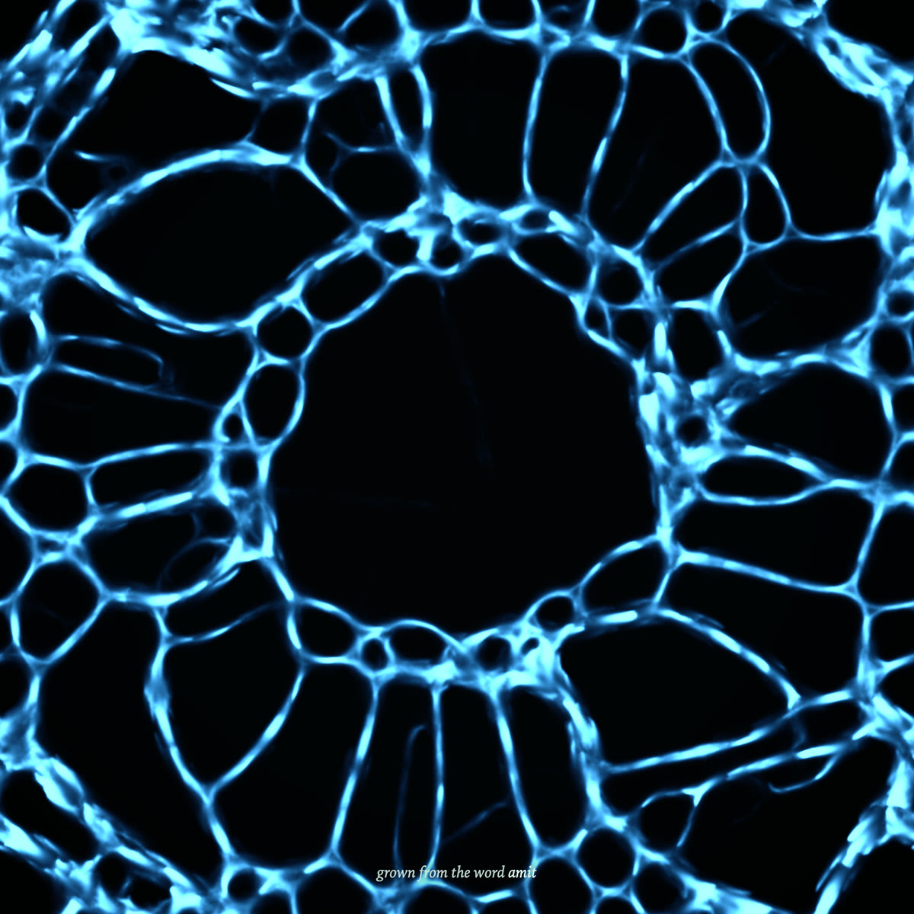

# Seed

Type a word. A million particles reorganize into an organism that belongs to that word.
Save it as a poster, or share a link that grows the same organism for someone else.



It is a Physarum (slime mold) simulation running live on the visitor's GPU through
WebGPU. There is no server, no model download, no login and no API. The page is a
static site of about 11 KB of JavaScript (gzipped) plus a recorded fallback video.

## How it works

Each particle follows three rules from [Jones 2010](https://direct.mit.edu/artl/article-abstract/16/2/127/2650):
sense the trail ahead-left, ahead and ahead-right; turn toward the strongest; step
forward and deposit. The trail blurs and decays every frame. Networks emerge from that.
The clearest plain-language explanation is [bleuje.com/physarum-explanation](https://bleuje.com/physarum-explanation/).

The word is a pure seed. It is hashed (FNV-1a), and the hash picks one of ten parameter
families, a point inside that family, a hue, and the starting position of every
particle. It does not draw the word's letters.

One addition to the classic rules: attraction rises with trail amount up to a
threshold and then falls. Without it, a million particles collapse into a few thick
lines and every word looks alike. `NOTES.md` has the sweep that found this.

Two further departures from the base model. Each particle varies its own sensor
distance, sensor angle, turn angle and step size according to the trail value it
senses locally, so one image carries fine detail where the network is crowded
and long reaching filaments where it is empty. And the pointer injects trail
directly into the field, so dragging feeds the organism and a click tears a hole
it then grows back into.

A second, fast-decaying buffer records where particles moved in roughly the last
half second. The renderer draws it as a brighter highlight on top of the slow
trail, which is what makes flow along the filaments visible.

### The GPU side

Raw WebGPU, no engine, zero runtime dependencies. Vite and TypeScript.

- Particles live in a storage buffer of `{x, y, angle}`, 16 bytes each.
- The trail is an `atomic<u32>` storage buffer in fixed point, not a texture. WGSL has
  no texture atomics, so a buffer is what makes two particles depositing on the same
  cell add up correctly.
- Particles sense last frame's trail and deposit into a separate buffer. The diffuse
  pass merges the two into the other ping-pong buffer. No particle ever sees another's
  deposit mid-frame.
- The render pass reads the trail buffer directly and maps it through the color ramp.
  The glow is the trail's own diffused halo on a log-like curve, not a blur pass.
- Poster export renders offscreen at 4096 x 4096 (2048 on phones) with bicubic
  filtering, reads it back with `copyTextureToBuffer`, and sets the caption in 2D.

## The same word grows the same organism

Every random choice is an integer PCG hash of the particle index and the word's hash,
which is exact on every GPU. On one machine, the same word gives a byte-identical
image, whether it was typed or opened from a link.

Across machines the claim is weaker and stated that way on purpose: the forms should
match visually, **not pixel for pixel**. WGSL specifies error bounds for float math and
permits reassociation ([WGSL 15.7.5](https://www.w3.org/TR/WGSL/#floating-point-accuracy)),
so `sin` and `cos` differ slightly between GPUs, and a chaotic system amplifies that.
Lower particle tiers also thin the organism while keeping its form.

Touching the organism breaks this by design. A fed or wounded organism is no
longer purely a function of its word. The share link is unaffected, because it
always grows from step zero and pointer input is never encoded in it.

When nobody touches it for four seconds of simulation, an invisible attractant
drifts across the field so the organism never sits still. That drift is timed by
the step count and not by the clock, so it follows the same path on every visit
and an untouched word stays reproducible. Typing reshapes the organism live, but
pressing Enter always regrows from step zero, so the typed path never leaks into
the committed result.

## Measured performance

Only numbers measured in this project. No published benchmarks exist for this.

| Machine | Browser | Particles | Frame rate | Startup |
| --- | --- | --- | --- | --- |
| MacBook, Apple M2, 8 GB | Chrome 153 | 1,000,000 | 60 fps (display ceiling) | 100 to 180 ms |
| MacBook, Apple M2, 8 GB | Chrome 153 | 2,000,000 (forced) | 60 fps (display ceiling) | about 100 ms |

Not measured yet: Windows with an RTX 3050 Ti, an Android phone, Safari. `NOTES.md`
says how to measure and holds the full table.

At startup the page times real simulation steps and picks one of five particle tiers
(150k to 2M). If frames run slow for a few seconds it quietly steps down a tier.

## Browser support

Needs WebGPU. Verified so far in Chrome 153 on macOS only. Other WebGPU browsers are
expected to work but are untested here; iOS in particular is unverified.

Without WebGPU (or if the GPU device is lost), the page plays a recording made from
its own canvas and says so in one line.

## Run it

```bash
npm install
npm run dev
```

Press the backquote key for the debug overlay: frame time, tier, benchmark, adapter limits.

Dev-only URL parameters (stripped from the production build):
`?sensorDist=9&decay=0.85` overrides any parameter, `?tier=0` forces a tier,
`?warm=600` fast-forwards, `?freeze` stops the clock, `?nogpu` rehearses the fallback,
`?measure=name` writes the overlay numbers to `docs/`.

```bash
npm run build
```

Output goes to `dist/`. It is a static site and deploys anywhere.

## Credits and licensing

- Algorithm: Jeff Jones, "Characteristics of pattern formation and evolution in
  approximations of Physarum transport networks", Artificial Life 16(2), 2010.
- Hash: Jarzynski and Olano, "Hash Functions for GPU Rendering", JCGT 9(3), 2020.
- Parameter ranges were cross-checked against [fogleman/physarum](https://github.com/fogleman/physarum) (MIT).
- Per-particle parameter modulation follows an idea described by Sage Jenson.
  No source was published for it, so the implementation here is our own.
- All WGSL and TypeScript here was written for this project. No code was copied from
  the GPL or CC BY-NC-SA Physarum implementations.
